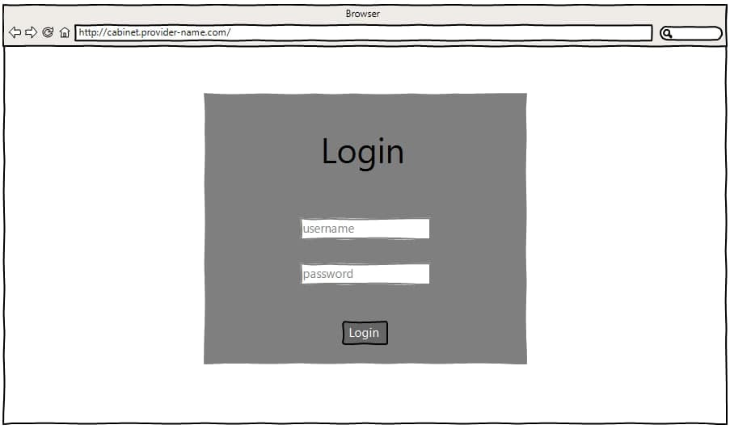
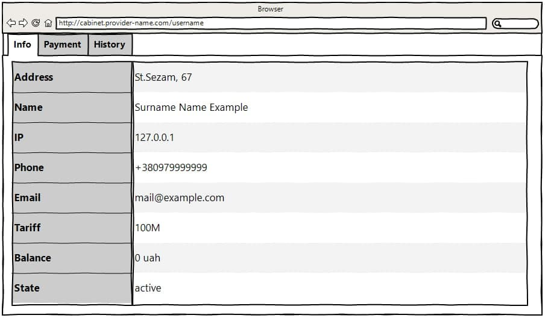
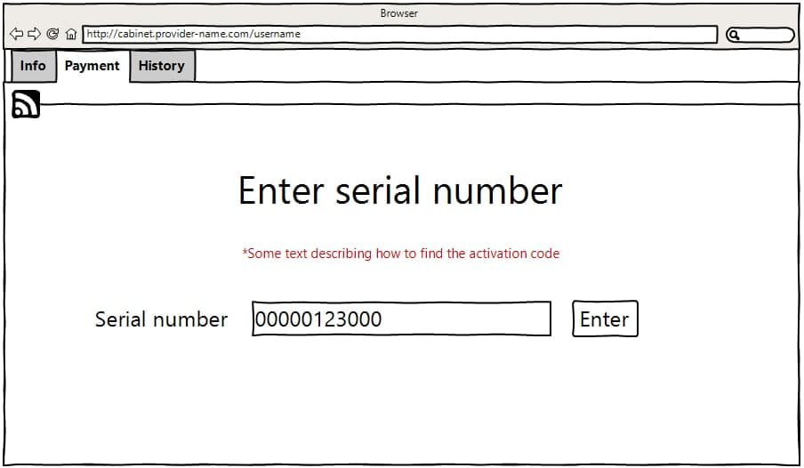
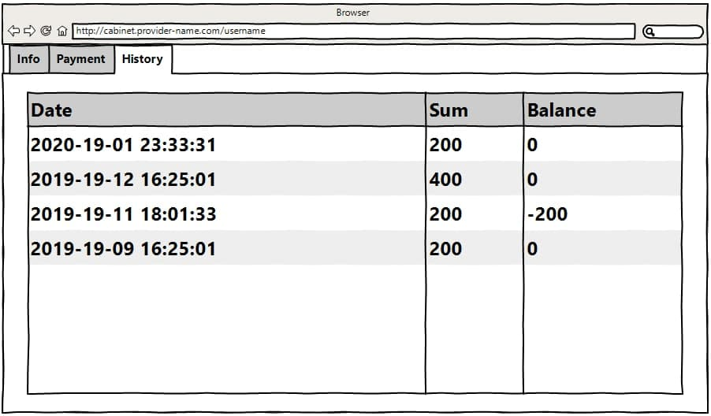
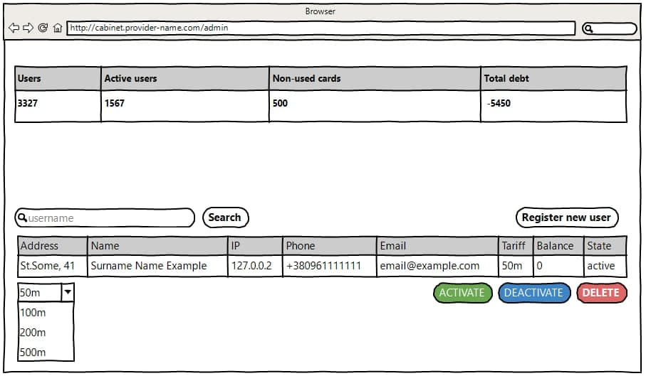
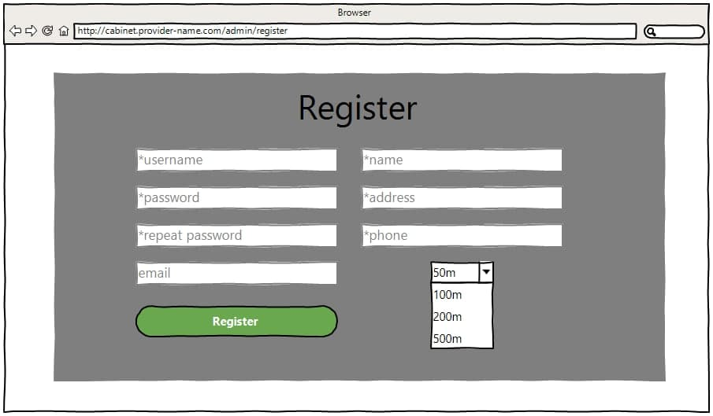

# Provider cabinet
## Vision

"Provider cabinet" is web-application which allows users to get some information about their Internet,
top up your account to continue using the services of the provider with payment cards, view payment history.
Also it allows admin to view some information, update / delete / create new users.

Application should provide:
+ User-friendly tables with all the necessary information
+ Ability to pay for Internet services
+ Ability to search for users, activate / deactivate / delete the account, change the tariff for a specific user 
for the admin account
+ Ability to register new users for the administrator account

## 1. Login
Once the user gets to the site, a window is displayed, which offers to enter the login and password

##### Main scenario:
+ User enters his login and password in the appropriate fields
+ If the password and login are correct, user is allowed into the cabinet, otherwise a corresponding 
message will be displayed

## 2. Cabinet
If the administrator is not logged in, the default cabinet will be displayed

### 2.1 Display info

##### Main scenario:
+ User select item "Info"
+ Application displays table with main information

The table has the following rows:
+ Address - home address of the user
+ Name - full name of the user
+ IP - ip address provided by provider
+ Phone - phone number of the user
+ Email - email of the user(if any)
+ Tariff - internet bandwidth, for which the user pays the appropriate amount
+ Balance - balance on the user's account from which the Internet fee is debited
+ State - indicates whether Internet services are provided

### 2.2 Payment
Payment is made using payment cards that can be purchased at the store

##### Main scenario:
+ User select item "Payment"
+ The code from the payment card is entered in the appropriate field
+ User click at the button "Enter"
+ If the code is correct, the user's balance will be replenished, otherwise a corresponding message will be displayed

### 2.3 History

##### Main scenario:
+ User select item "History"
+ Application displays table with payment history

The table has the following columns:
+ Date - payment date with exact time
+ Sum - the amount for which the replenishment was made
+ Balance - balance after replenishment

## 3. Admin
If the user is logged in using the admin username then he gets access to the admin panel

The page has the following components:
* Buttons:
    + Reload(icon) - updates the table opposite which stands
    + Search - searches for the user by the username entered in the field next to it
    + Activate/Deactivate - provides or terminates the provision of services by the provider to the user
    + Delete - removes the user from the database. The supply of services is terminated automatically
    + Register new user - adds a new user to the database
* Tables:
    + the table with global information
    + the table that appears when the administrator finds the user by username
* Drop down list - required to change the tariff for the user

## Register

The form has the following components:
* Fields:
    + Username - unique identifier of the user (login)
    + Password - the password by which the user will log in
    + Repeat password - a field in which you need to enter the same password to make sure everything is correct 
    with your password
    + Email - email of the user
    + Name - full name of the user
    + Address - home address of the user
    + Phone - phone number of the user
* Button "Register" - the button required to register user
* Drop down list - required to choose the tariff for the user
###### fields with * is required
